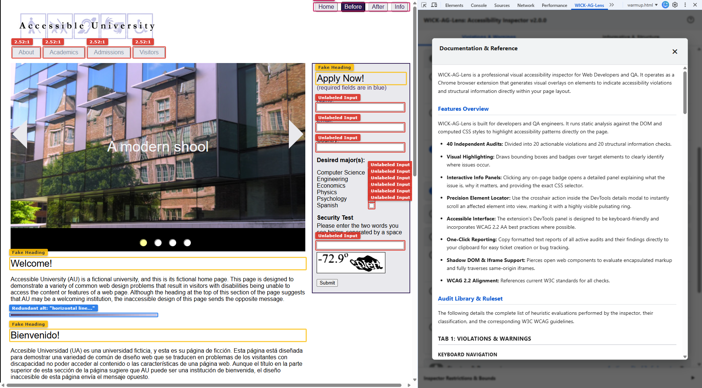

# WICK-AG-Lens: Accessibility Inspector

WICK-AG-Lens is a professional visual accessibility inspector for Web Developers and QA. It operates as a **Chrome browser extension** that generates visual overlays on elements to indicate accessibility violations and structural information directly within your page layout.

You can install WICK-AG-Lens from the Chrome Web Store: **[Install Here](https://chromewebstore.google.com/detail/accessibility-inspector/fjbgedagallcokpkfdlmpafcffblmlhd)**.

&nbsp;

&nbsp;

## Table of Contents
1. [Features Overview](#features-overview)
2. [Feature List](#feature-list)
3. [Implementation Details: Violations & Warnings](#implementation-details-violations--warnings)
4. [Implementation Details: Informative & Structure](#implementation-details-informative--structure)
5. [Search Predicates and Logic Definitions](#search-predicates-and-logic-definitions)
6. [Limitations & Technical Bounds](#limitations--technical-bounds)
7. [Compatibility](#compatibility)
8. [License](#license)
9. [Contributing](#contributing)
10. [Changelog](#changelog)

## Features Overview
WICK-AG-Lens is built for developers and QA engineers. It runs static analysis against the DOM and computed CSS styles to highlight accessibility patterns directly on the pag.

*   **40 Independent Audits:** Divided into actionable violations and structural information checks covering many of the most common issues identified across WCAG 2.0, 2.1, and 2.2 at the A, AA, and AAA conformance levels.
*   **WCAG Criteria Filtering:** Dynamically restrict audits and legend items by specific WCAG versions (2.0, 2.1, 2.2) and conformance levels (A, AA, AAA).
*   **Visual Highlighting:** Draws bounding boxes and badges over target elements to clearly identify where issues occur.
*   **Interactive Info Panels:** Clicking any on-page badge opens a detailed panel explaining what the issue is, why it matters, and providing the exact CSS selector.
*   **Precision Element Locator:** Use the crosshair action inside the DevTools details modal to instantly scroll an affected element into view, marking it with a highly visible pulsating ring.
*   **Accessible Interface:** The extension's DevTools panel is designed to be keyboard-friendly and incorporates WCAG 2.2 AA best practices where possible.
*   **One-Click Reporting:** Copy formatted text reports of all active audits and their findings directly to your clipboard for easy ticket creation or bug tracking.
*   **Shadow DOM & Iframe Support:** Pierces open web components to evaluate encapsulated markup and fully traverses same-origin iframes using deep bottom-up traversal.
*   **WCAG Alignment:** References current W3C standards for all checks.

## Installation

Installing WICK-AG-Lens takes just a few clicks from the official Chrome Web Store.

1. Navigate to the [WICK-AG-Lens page on the Chrome Web Store](https://chromewebstore.google.com/detail/accessibility-inspector/fjbgedagallcokpkfdlmpafcffblmlhd).

2. Click the **Add to Chrome** button located in the top right corner of the page.

3. A confirmation browser dialog will appear. Click **Add extension** to grant the necessary permissions for the tool to inspect pages.

4. You will receive a message saying WICK-AG-Lens has been added to Chrome.

5. Once installed, open your Chrome Developer Tools (`F12` or `Ctrl+Shift+I` on Windows/Linux, `Cmd+Option+I` on Mac).

6. Locate the **WICK-AG-Lens** tab in the top navigation bar of the DevTools panel. Note: You may need to click the `>>` icon if your DevTools window is narrow.

7. And that's it!

## Audit Library & Ruleset

### Tab 1: Violations & Warnings

**Keyboard Navigation**
*   **Unfocusable Clickables:** Flags generic elements with onclick handlers lacking tabindex and role. This is a Critical severity issue because keyboard users cannot tab to or activate these elements. Legend: Violation.
*   **Disabled Focus Outlines:** Parses page CSS via heuristic evaluation to find focusable elements where outline is none or 0 on the focus state without a fallback box-shadow or border. This is a Critical severity issue because sighted keyboard users rely entirely on focus rings to know which element they are interacting with. Legend: Violation.
*   **Tabindex Violations:** Flags elements with tabindex > 0. This is a Serious severity issue because it overrides natural DOM focus order, creating unpredictable navigation paths. Legend: tabindex > 0.
*   **Accesskey Attributes:** Flags explicit accesskey usage. This is a Moderate severity issue because it often conflicts with native browser or screen reader shortcuts. Legend: Warning.

**Images & Media**
*   **Missing Alt Text:** Flags img elements completely lacking an alt attribute. This is a Critical severity issue because screen readers will read the raw filename if alt is missing. Legend: Violation.
*   **Uncaptioned Video:** Flags video elements lacking nested track elements. This is a Critical severity issue because deaf or hard of hearing users require captions for video content. Legend: Violation.
*   **Redundant Alt Text:** Flags alt attributes containing words like image or photo. This is a Minor severity issue because screen readers automatically announce images, making these prefixes redundant. Legend: Violation.

**Forms & Controls**
*   **Unlabeled Form Inputs:** Flags form controls missing label wrappers, aria labels, or for attributes. This is a Critical severity issue because screen readers cannot announce what the input is for. Legend: Violation.
*   **Empty Buttons:** Flags buttons with no text, aria-label, or child image alt. This is a Critical severity issue because screen readers will only announce 'Button', providing no context. Legend: Violation.
*   **Placeholder as Label:** Flags inputs relying solely on placeholders for their accessible name. This is a Serious severity issue because placeholders disappear on typing and often lack contrast. Legend: Violation.

**Links & Navigation**
*   **Empty Links:** Flags a tags lacking readable text or accessible names. This is a Critical severity issue because screen readers will read the URL, which is often confusing. Legend: Violation.
*   **Suspicious Link Targets:** Flags anchor tags that lack actual routing destinations and are missing a button role. This is a Critical severity issue because using links to trigger JS actions confuses screen readers and breaks expected spacebar keyboard operability. Legends: javascript: (Critical) and href='#' (Serious).
*   **Generic Link Text:** Flags ambiguous link text like Click Here or Read More using exact word boundaries to avoid false positives. This is a Moderate severity issue because users navigating via a Links List will lack context for the destination. Legend: Violation.
*   **Unwarned New Window Links:** Flags target blank links lacking text or ARIA warnings. This is a Moderate severity issue because unexpectedly opening new tabs disorients cognitive and screen reader users. Legend: Violation.

**ARIA & Semantics**
*   **Focusable in Aria-Hidden:** Flags elements that receive keyboard focus but are hidden from Assistive Technologies via `aria-hidden='true'` on the element or an ancestor. This creates a severe "ghost focus" mismatch. Legend: Violation.
*   **Invalid ARIA State:** Flags elements marked with aria-invalid='true'. This is a Serious severity issue because it identifies application-enforced validation errors. Legend: Violation.
*   **Prohibited Author Names:** Flags presentation or none roles that improperly contain aria-label or aria-labelledby. This is a Serious severity issue because adding a name to a transparent structural role breaks its semantics. Legend: Violation.

**Structure & Document**
*   **Auto-playing Media:** Flags audio or video with autoplay enabled. This is a Serious severity issue because unexpected audio conflicts with screen reader announcements. Legend: Violation.
*   **Heading Hierarchy Errors:** Flags skipped sequential levels or fake structural classes. This is a Moderate severity issue because headings map document structure, and skipping levels confuses screen reader navigation. Legend: Violation.

**Visual & Contrast**
*   **Text Color Contrast:** Traverses the DOM to calculate the effective contrast ratio between visible text and its backing container, dynamically factoring in font-size and font-weight for large-text thresholds. Elements over images/gradients are flagged for manual review. Legends: AA Fail, AAA Fail, Manual Check.

### Tab 2: Informative & Structure

**Keyboard Navigation**
*   **Tabindex (Comparison):** Highlights all tabindex usages simultaneously. Important to provide a visual map of the programmatic focus strategy and custom widget interactions. Legends: 0 (Valid), -1 (Scripted), > 0 (Warn).
*   **Display Focus Order:** Traces and numbers the natural sequential path of focusable elements. It dynamically flags elements that receive keyboard focus but are hidden from Assistive Technologies via `aria-hidden='true'` on the element or an ancestor. Legends: Valid Focus, Hidden from AT (aria-hidden).

**Images & Media**
*   **Display Image Alternatives:** Extracts and visually prints the alt text for all img elements. Important to allow quick visual auditing of alternative text descriptions. Legends: Has Alt, Decorative, Missing.
*   **Captioned Video:** Highlights video elements that correctly implement track captions. Important to confirm proper multimedia accessibility setup. Legend: Has Captions.
*   **Iframe Context & Titles:** Extracts explicitly defined titles from embedded iframes. Important because screen readers announce the title to inform the user what the sub-document contains before they enter it. Legends: Titled (Valid), Hidden, Missing Title.

**Forms & Controls**
*   **Form Field Descriptions:** Identifies supplemental instructional text linked to inputs via aria-describedby or title. Important to ensure extended hints or error messages are programmatically tied to inputs. Legend: Description.
*   **Fieldsets & Captions:** Highlights visual grouping containers and their titles. Important for grouping related radio buttons or complex form sections. Legend: Grouping.
*   **Touch Target Sizes:** Computes the exact width and height pixel boundaries of interactive elements. Important because undersized targets prevent users with fine motor impairments from activating controls accurately. Legends: < 24px (Fail), 24-43px (AA Min), 44px+ (AAA).

**Links & Navigation**
*   **Warned New Window Links:** Highlights target blank links that correctly include accessible warnings. Important to confirm proper communication of context shifts to assistive technologies. Legend: Warned.

**ARIA & Semantics**
*   **ARIA Roles & Attributes:** Maps all elements utilizing an explicit role definition. Important to allow auditing of custom widget semantics. Legend: Role.
*   **ARIA Live Regions:** Maps dynamic aria-live injection containers. Important to ensure dynamic content updates are announced to screen readers. Legend: Live Region.
*   **Required Fields:** Maps mandatory inputs enforced via HTML5 required or aria-required. Important to ensure required status is programmatically available. Legend: Required.
*   **Aria-Expanded State:** Maps expandable widgets, color-coded by true or false state. Important to visualize the current programmatic state of accordions and menus. Legends: True, False.
*   **Aria-Controls:** Highlights elements that dictate the visibility of remote DOM elements. Important because links trigger mechanisms to their targets. Legend: Controls.
*   **Aria-Owns:** Highlights elements establishing parent or child relationships outside the DOM tree. Important to reconstruct accessibility tree hierarchy for disjointed widgets. Legend: Owns.

**Structure & Document**
*   **Valid Heading Order:** Maps the standard, sequential H1 to H6 structure. Important to verify the logical outline of the page. Legend: Heading.
*   **Landmark Regions:** Maps native HTML5 and ARIA structural containers. Important to allow screen reader users to jump quickly between page sections. Legend: Landmark.
*   **Table & Grid Structure:** Highlights native tables, captions, headers, as well as custom div-based structures. Important to visually map data structures and verify custom UI grids implement semantic headers. Legends: Table/Grid, Header.
*   **Lists and List Items:** Maps unordered, ordered, and glossary lists and children. Important to ensure related items are programmatically grouped. Legend: List Element.
*   **Language Definitions:** Maps the root document language declaration alongside inline phonetic shifts. Important because screen readers rely on the language tag to load the correct accent and pronunciation rules. Legends: Root Lang Missing, Root Lang, Inline Shift.

## Implementation Details: Violations & Warnings

| Category | Analysis Meaning & WCAG Link | Classification | Logic Reference | Badge Output |
| :--- | :--- | :--- | :--- | :--- |
| Keyboard Navigation | Unfocusable Clickables. [WCAG 2.1.1](https://www.w3.org/WAI/WCAG22/Understanding/keyboard.html) | Critical | [View Logic](#v-1) | `"Unfocusable Clickable"` |
| Keyboard Navigation | Disabled Focus Outlines. [WCAG 2.4.7](https://www.w3.org/WAI/WCAG22/Understanding/focus-visible.html) | Critical | [View Logic](#v-2) | `"Disabled Focus Ring (Heuristic)"` |
| Keyboard Navigation | Tabindex Violations. [WCAG 2.4.3](https://www.w3.org/WAI/WCAG22/Understanding/focus-order.html) | Serious | [View Logic](#v-3) | `tabindex="{val}"` |
| Keyboard Navigation | Accesskey Attributes. [WCAG 2.1.4](https://www.w3.org/WAI/WCAG22/Understanding/character-key-shortcuts.html) | Moderate | [View Logic](#v-4) | `accesskey="{val}"` |
| Images & Media | Missing Alt Text. [WCAG 1.1.1](https://www.w3.org/WAI/WCAG22/Understanding/non-text-content.html) | Critical | [View Logic](#v-5) | `"Missing alt"` |
| Images & Media | Uncaptioned Video. [WCAG 1.2.2](https://www.w3.org/WAI/WCAG22/Understanding/captions-prerecorded.html) | Critical | [View Logic](#v-6) | `"<video> (No Captions)"` |
| Images & Media | Redundant Alt Text. [WCAG 1.1.1](https://www.w3.org/WAI/WCAG22/Understanding/non-text-content.html) | Minor | [View Logic](#v-7) | `Redundant alt: "{truncated text}"` |
| Forms & Controls | Unlabeled Form Inputs. [WCAG 3.3.2](https://www.w3.org/WAI/WCAG22/Understanding/labels-or-instructions.html) | Critical | [View Logic](#v-8) | `"Unlabeled Input"` |
| Forms & Controls | Empty Buttons. [WCAG 4.1.2](https://www.w3.org/WAI/WCAG22/Understanding/name-role-value.html) | Critical | [View Logic](#v-9) | `"Empty Button"` |
| Forms & Controls | Placeholder as Label. [WCAG 4.1.2](https://www.w3.org/WAI/WCAG22/Understanding/name-role-value.html) | Serious | [View Logic](#v-10) | `"Placeholder as Label"` |
| Links & Navigation | Empty Links. [WCAG 2.4.4](https://www.w3.org/WAI/WCAG22/Understanding/link-purpose-in-context.html) | Critical | [View Logic](#v-11) | `"Empty Link"` |
| Links & Navigation | Suspicious Link Targets. [WCAG 4.1.2](https://www.w3.org/WAI/WCAG22/Understanding/name-role-value.html), [WCAG 2.1.1](https://www.w3.org/WAI/WCAG22/Understanding/keyboard.html) | Critical / Serious | [View Logic](#v-12) | `"Fake Button (JS)"` or `"Fake Button (#)"` |
| Links & Navigation | Generic Link Text. [WCAG 2.4.4](https://www.w3.org/WAI/WCAG22/Understanding/link-purpose-in-context.html) | Moderate | [View Logic](#v-13) | `Generic link: "{text}"` |
| Links & Navigation | Unwarned New Window Links. [WCAG 3.2.5](https://www.w3.org/WAI/WCAG22/Understanding/change-on-request.html) | Moderate | [View Logic](#v-14) | `'target="_blank" (No Warning)'` |
| ARIA & Semantics | Focusable in Aria-Hidden. [WCAG 4.1.2](https://www.w3.org/WAI/WCAG22/Understanding/name-role-value.html) | Critical | [View Logic](#v-15) | `"aria-hidden (Focusable)"` |
| ARIA & Semantics | Invalid ARIA State. [WCAG 3.3.1](https://www.w3.org/WAI/WCAG22/Understanding/error-identification.html) | Serious | [View Logic](#v-16) | `'aria-invalid="true"'` |
| ARIA & Semantics | Prohibited Author Names. [WCAG 4.1.2](https://www.w3.org/WAI/WCAG22/Understanding/name-role-value.html) | Serious | [View Logic](#v-17) | `Prohibited name on role="{role}"` |
| Structure & Document | Auto-playing Media. [WCAG 1.4.2](https://www.w3.org/WAI/WCAG22/Understanding/audio-control.html) | Serious | [View Logic](#v-18) | `"Autoplay Media"` |
| Structure & Document | Heading Hierarchy Errors. [WCAG 1.3.1](https://www.w3.org/WAI/WCAG22/Understanding/info-and-relationships.html) | Moderate | [View Logic](#v-19) | `"{TAG} (Skipped)"` or `"Fake Heading"` |
| Visual & Contrast | Text Color Contrast. [WCAG 1.4.3](https://www.w3.org/WAI/WCAG22/Understanding/contrast-minimum.html), [WCAG 1.4.6](https://www.w3.org/WAI/WCAG22/Understanding/contrast-enhanced.html) | Critical | [View Logic](#v-20) | `AA Fail`, `AAA Fail`, `Manual Check` |

## Implementation Details: Informative & Structure

| Category | Analysis Meaning & WCAG Link | Classification | Logic Reference | Badge Output |
| :--- | :--- | :--- | :--- | :--- |
| Keyboard Navigation | Tabindex (Comparison). [WCAG 2.4.3](https://www.w3.org/WAI/WCAG22/Understanding/focus-order.html) | Informative | [View Logic](#i-1) | `tabindex="{val}"` |
| Keyboard Navigation | Display Focus Order. [WCAG 2.4.3](https://www.w3.org/WAI/WCAG22/Understanding/focus-order.html) | Informative | [View Logic](#i-2) | `#{counter}: <{tag}>` or `#{counter}: <{tag}> (Hidden from AT)` |
| Images & Media | Display Image Alternatives. [WCAG 1.1.1](https://www.w3.org/WAI/WCAG22/Understanding/non-text-content.html) | Informative | [View Logic](#i-3) | `alt="{val}"`, `alt=""`, or `"Missing alt"` |
| Images & Media | Captioned Video. [WCAG 1.2.2](https://www.w3.org/WAI/WCAG22/Understanding/captions-prerecorded.html) | Informative | [View Logic](#i-4) | `"<video> (Captioned)"` |
| Images & Media | Iframe Context & Titles. [WCAG 4.1.2](https://www.w3.org/WAI/WCAG22/Understanding/name-role-value.html) | Informative | [View Logic](#i-5) | `title="{title}"`, `"Hidden Iframe"`, or `"Missing Title"` |
| Forms & Controls | Form Field Descriptions. [WCAG 3.3.2](https://www.w3.org/WAI/WCAG22/Understanding/labels-or-instructions.html) | Informative | [View Logic](#i-6) | `"aria-describedby"` or `"title"` |
| Forms & Controls | Fieldsets & Captions. [WCAG 1.3.1](https://www.w3.org/WAI/WCAG22/Understanding/info-and-relationships.html) | Informative | [View Logic](#i-7) | `<{tag}>` |
| Forms & Controls | Touch Target Sizes. [WCAG 2.5.8](https://www.w3.org/WAI/WCAG22/Understanding/target-size-minimum.html) | Informative | [View Logic](#i-8) | `{width}x{height}px` |
| Links & Navigation | Warned New Window Links. [WCAG 3.2.5](https://www.w3.org/WAI/WCAG22/Understanding/change-on-request.html) | Informative | [View Logic](#i-9) | `'target="_blank" (Warned)'` |
| ARIA & Semantics | ARIA Roles & Attributes. [WCAG 4.1.2](https://www.w3.org/WAI/WCAG22/Understanding/name-role-value.html) | Informative | [View Logic](#i-10) | `role="{val}"` |
| ARIA & Semantics | ARIA Live Regions. [WCAG 4.1.3](https://www.w3.org/WAI/WCAG22/Understanding/status-messages.html) | Informative | [View Logic](#i-11) | `aria-live="{val}"` |
| ARIA & Semantics | Required Fields. [WCAG 3.3.1](https://www.w3.org/WAI/WCAG22/Understanding/error-identification.html) | Informative | [View Logic](#i-12) | `"required"` or `'aria-required="true"'` |
| ARIA & Semantics | Aria-Expanded State. [WCAG 4.1.2](https://www.w3.org/WAI/WCAG22/Understanding/name-role-value.html) | Informative | [View Logic](#i-13) | `aria-expanded="{val}"` |
| ARIA & Semantics | Aria-Controls. [WCAG 4.1.2](https://www.w3.org/WAI/WCAG22/Understanding/name-role-value.html) | Informative | [View Logic](#i-14) | `"aria-controls"` |
| ARIA & Semantics | Aria-Owns. [WCAG 4.1.2](https://www.w3.org/WAI/WCAG22/Understanding/name-role-value.html) | Informative | [View Logic](#i-15) | `"aria-owns"` |
| Structure & Document | Valid Heading Order. [WCAG 1.3.1](https://www.w3.org/WAI/WCAG22/Understanding/info-and-relationships.html) | Informative | [View Logic](#i-16) | `<{tag}>` |
| Structure & Document | Landmark Regions. [WCAG 2.4.1](https://www.w3.org/WAI/WCAG22/Understanding/bypass-blocks.html) | Informative | [View Logic](#i-17) | `<{role or tag}>` |
| Structure & Document | Table & Grid Structure. [WCAG 1.3.1](https://www.w3.org/WAI/WCAG22/Understanding/info-and-relationships.html) | Informative | [View Logic](#i-18) | `<{tag}>` or `role="{role}"` |
| Structure & Document | Lists and List Items. [WCAG 1.3.1](https://www.w3.org/WAI/WCAG22/Understanding/info-and-relationships.html) | Informative | [View Logic](#i-19) | `<{tag}>` |
| Structure & Document | Language Definitions. [WCAG 3.1.1](https://www.w3.org/WAI/WCAG22/Understanding/language-of-page.html), [WCAG 3.1.2](https://www.w3.org/WAI/WCAG22/Understanding/language-of-parts.html) | Informative | [View Logic](#i-20) | `"Missing Root Lang"`, `Root lang="{val}"`, or `lang="{val}"` |

## Search Predicates and Logic Definitions

Elements hidden via CSS parameters like `display: none` or `visibility: hidden`, or by using the HTML `inert` attribute, are excluded by the global DOM processing logic before the specific audits run.

**DOM Traversal:** The extension utilizes a custom deep `querySelectorAll` function combined with bottom-up ancestor mapping. This allows the scanner to properly pierce standard (open) Shadow DOM boundaries and fully traverse the internal DOM of same-origin iframes, guaranteeing accurate visibility tracking across complex widget architectures.

**Self-Auditing Guard:** The injected extension UI elements (like the overlay boxes and the information toast panels) are specifically excluded from audits to prevent false positives.

### Tab 1: Violations & Warnings

*   **Unfocusable Clickables:** Uses the CSS selector `div[onclick], span[onclick], section[onclick]`. The Javascript logic evaluates each element to ensure it lacks a `role` attribute or lacks a `tabindex` attribute before flagging a violation.
*   **Disabled Focus Outlines:** Uses the base CSS selector `a[href], button, input, select, textarea, [tabindex]:not([tabindex='-1'])`. The Javascript logic iterates through `document.styleSheets` and checks each `CSSRule.STYLE_RULE` to see if the selector includes `:focus` or `:focus-visible`. It reads the `outline`, `outlineWidth`, `boxShadow`, and `border` properties. If outline rules contain `none` or `0px` and no fallback border or shadow is provided, the selector is recorded. Any interactive element matching that recorded selector is flagged.
*   **Tabindex Violations:** Uses the CSS selector `[tabindex]`. The logic parses the attribute value as a base 10 integer and triggers a violation if the value is strictly greater than 0.
*   **Accesskey Attributes:** Uses the CSS selector `[accesskey]`. All elements matching this selector are flagged.
*   **Missing Alt Text:** Uses the CSS selector `img:not([alt])`. All elements matching this selector are flagged.
*   **Uncaptioned Video:** Uses the CSS selector `video`. The logic queries descendants for `track[kind="captions"], track[kind="subtitles"]`. If the result length is 0, the video is flagged.
*   **Redundant Alt Text:** Uses the CSS selector `img[alt]`. The logic reads the alt attribute and uses the regular expression `/\b(image|img|photo|picture|graphic)\b/i` to identify redundant terms before flagging.
*   **Unlabeled Form Inputs:** Uses the CSS selector `input:not([type='hidden']):not([type='submit']):not([type='button']), select, textarea`. The logic searches the document for a `<label>` with a `for` attribute matching the input ID. It also checks the element for `aria-label` or `aria-labelledby` attributes, or if it is nested directly inside a `label` element. If all checks fail, it is flagged.
*   **Empty Buttons:** Uses the CSS selector `button, [role='button']`. The logic checks the text content of the element, the presence of `aria-label` or `aria-labelledby`, and the presence of child `img[alt]` elements. If the trimmed text is empty and alternative names are missing, it flags a violation.
*   **Placeholder as Label:** Uses the CSS selector `input[placeholder], textarea[placeholder]`. The logic checks if the element lacks a `label[for]` referencing its ID and lacks `aria-label` or `aria-labelledby` attributes.
*   **Empty Links:** Uses the CSS selector `a[href]`. The logic evaluates the text content, ARIA labels, and child image alt text. If all sources of accessible names are empty, it triggers a violation.
*   **Suspicious Link Targets:** Uses the CSS selector `a[href='#'], a[href^='javascript:']`. The logic ignores elements that possess `role="button"`. It categorizes the remaining matches based on whether the `href` prefix is javascript or a hash.
*   **Generic Link Text:** Uses the CSS selector `a[href]`. The logic trims the text content and applies an exact word boundary regular expression `/\b(click here|read more|learn more|more|link|here)\b/i` to flag matching elements.
*   **Unwarned New Window Links:** Uses the CSS selector `a[target='_blank']`. The logic concatenates the text content and `aria-label` to test against the regular expression `/new (window|tab)/`. If no match is found, it flags a violation.
*   **Focusable in Aria-Hidden:** Uses a bottom-up DOM traversal to check if any naturally focusable element (or its ancestors) possesses `aria-hidden='true'`. Pierces Shadow DOMs and iframes to ensure accurate detection of ghost focus traps.
*   **Invalid ARIA State:** Uses the CSS selector `[aria-invalid='true']`. Elements matching the selector are flagged.
*   **Prohibited Author Names:** Uses the CSS selector `[role='presentation'], [role='none'], [role='generic']`. The logic triggers a violation if the matched element has an `aria-label` or `aria-labelledby` attribute.
*   **Auto-playing Media:** Uses the CSS selector `audio[autoplay], video[autoplay]`. Elements matching the selector are flagged.
*   **Heading Hierarchy Errors:** Uses the CSS selector `h1, h2, h3, h4, h5, h6, [role='heading'], [class*='heading'], [class*='title']`. The logic tracks the integer level of headings. It flags an element if the current heading level skips sequentially past the previous tracked level. It also flags elements without a role attribute if the text length is under 80 characters.
*   **Text Color Contrast:** Uses the CSS selector targeting standard text elements like `h1`, `p`, `span`, `button`. The logic verifies child text nodes exist. It uses `window.getComputedStyle` to retrieve the foreground color and background color, dynamically factoring in `font-size` and `font-weight` against WCAG large-text thresholds. It applies the WCAG relative luminance formula and categorizes failures as AA Fail or AAA Fail. Elements over background images or CSS gradients are automatically flagged for manual review.

### Tab 2: Informative & Structure

*   **Tabindex (Comparison):** Uses the CSS selector `[tabindex]`. The logic parses the attribute as an integer and assigns different visual legends based on whether the value is equal to 0, less than 0, or greater than 0.
*   **Display Focus Order:** Traces and numbers the natural sequential path of focusable elements. It dynamically flags elements that receive keyboard focus but are hidden from Assistive Technologies via `aria-hidden='true'` on the element or an ancestor. Legends: Valid Focus, Hidden from AT (aria-hidden).
*   **Display Image Alternatives:** Uses the CSS selector `img`. The logic assigns distinct legends depending on whether the `alt` attribute is completely missing, present but empty, or populated.
*   **Captioned Video:** Uses the CSS selector `video`. The logic checks for child `track[kind="captions"]` or `track[kind="subtitles"]` elements to highlight the video.
*   **Iframe Context & Titles:** Uses the CSS selector `iframe`. The logic checks if the iframe has `aria-hidden` set to true or `tabindex` set to -1. It flags missing titles if the `title` attribute is missing or empty, otherwise, it outputs the title text.
*   **Form Field Descriptions:** Uses the CSS selector `[aria-describedby], [title]`. The logic outputs the presence of these specific attributes to the badge.
*   **Fieldsets & Captions:** Uses the CSS selector `fieldset, legend`. Elements matching the selector are highlighted.
*   **Touch Target Sizes:** Uses a CSS selector targeting interactive elements and roles like `button`, `link`, `checkbox`, `slider`. The logic uses `getBoundingClientRect()` to compute width and height. It finds the minimum of the two dimensions and categorizes the element based on limits at 24px and 44px.
*   **Warned New Window Links:** Uses the CSS selector `a[target='_blank']`. The logic combines the text content and `aria-label` to test against the regular expression `/new (window|tab)/`. Matches are highlighted.
*   **ARIA Roles & Attributes:** Uses the CSS selector `[role]`. The logic retrieves the value of the role attribute for display.
*   **ARIA Live Regions:** Uses the CSS selector `[aria-live]`. The logic retrieves the value of the aria-live attribute for display.
*   **Required Fields:** Uses the CSS selector `[required], [aria-required='true']`. The logic distinguishes between HTML required attributes and ARIA required attributes for the output.
*   **Aria-Expanded State:** Uses the CSS selector `[aria-expanded]`. The logic categorizes the element based on whether the attribute equals true or false.
*   **Aria-Controls:** Uses the CSS selector `[aria-controls]`. Elements matching the selector are highlighted.
*   **Aria-Owns:** Uses the CSS selector `[aria-owns]`. Elements matching the selector are highlighted.
*   **Valid Heading Order:** Uses the CSS selector `h1, h2, h3, h4, h5, h6`. Elements matching the selector are highlighted.
*   **Landmark Regions:** Uses the CSS selector `main, nav, header, footer, aside, [role='main'], [role='navigation'], [role='banner'], [role='contentinfo']`. The logic retrieves the role attribute or the HTML tag name for the badge output.
*   **Table & Grid Structure:** Uses the CSS selector `table, caption, th, [role='table'], [role='grid'], [role='treegrid'], [role='columnheader'], [role='rowheader']`. The logic applies a dashed style to header roles and tags, and applies a solid style for grid and table containers.
*   **Lists and List Items:** Uses the CSS selector `ul, ol, li, dl, dt, dd`. Elements matching the selector are highlighted.
*   **Language Definitions:** Uses the CSS selector `html, [lang], [xml\:lang]`. The logic checks if the element is the root html tag. It flags the element if the root tag is missing a language attribute. It categorizes root language declarations separately from inline phonetic shifts.

## Limitations & Technical Bounds

*   **Visibility Filtering:** Elements hidden via `display: none`, `visibility: hidden`, `hidden`, or `inert` are strictly excluded from all analysis to match native accessibility tree behavior.
*   **Visual Occlusion:** Visibility calculations rely on CSS properties. The tool does not calculate 3D geometric occlusion (e.g., an element technically "visible" in CSS but visually covered by a high `z-index` modal).
*   **Focus Order:** Mirrors standard browser Tab execution, prioritizing `tabindex > 0`, respecting native Radio Group bundling, and ignoring disabled/hidden nodes.
*   **Shadow DOMs:** Standard (open) Web Components are fully traversed and supported. Explicitly 'closed' Shadow Roots remain inaccessible by browser design.
*   **Iframes & Cross-Origin Policies:** The inspector traverses and audits the internal DOM of same-origin iframes. Due to strict browser security (Same-Origin Policy), it cannot pierce cross-origin iframes (e.g., embedded YouTube videos or third-party widgets).
*   **Color Contrast Heuristics:** Contrast ratios are calculated using computed DOM styles. Elements overlaying complex backgrounds (images, gradients) are explicitly flagged for Manual Review. The algorithm dynamically calculates required thresholds based on computed font-size and font-weight.
*   **WCAG Criteria Filtering:** The version (2.0, 2.1, 2.2) and conformance level (A, AA, AAA) filters are strictly isolated. Selecting version 2.2 does *not* automatically include 2.0 or 2.1 audits, and selecting AAA does *not* include A or AA checks. You must explicitly check all versions and levels you wish to evaluate in your current analysis.

## Compatibility
*   **Browser:** Compatible with Google Chrome version 100.0 or higher.
*   **Permissions:** Operates on all URLs permitted by the user using the `activeTab`, `scripting`, and `storage` host permissions.

## License
WICK-AG-Lens is available under the MIT License. Reference the [LICENSE.md](./LICENSE.md) file for standard permissions and limitations.

## CONTRIBUTING

First off, thanks for taking the time to contribute!

To contribute, please follow the process described in **[CONTRIBUTING.md](CONTRIBUTING.md "CONTRIBUTING.md")**

And if you like the project but just don't have the time to contribute, that's fine. There are other easy ways to support the project and show your appreciation, which we would also be very happy about:
- Star the project
- Promote it on social media
- Refer this project in your project's readme
- Mention the project at local meetups and tell your friends/colleagues
- Buying me a coffee or contributing to a training session, so I can keep learning and sharing cool stuff with all of you.

Thank you for your support!

## Changelog
*   **v2.1.0:** Introduced dynamic WCAG Version (2.0, 2.1, 2.2) and Conformance Level (A, AA, AAA) UI filtering. Re-engineered DOM traversal for visibility calculations to seamlessly cross Shadow DOMs and same-origin iframes. Enhanced the Focus Order trace and "Focusable in Aria-Hidden" audits to dynamically detect "ghost focus" traps using deep bottom-up traversal. Updated Text Color Contrast to dynamically evaluate font-size and weight against thresholds, and explicitly flag complex backgrounds. Updated Generic Link text regex to strictly enforce word boundaries. Added DevTools UI toast notification system.
*   **v2.0.0:** Major release. Replaced icons and incorporated WCAG 2.2 AAA compliant styling changes. Added new heuristic auditing capabilities (Disabled Focus Outlines). Removed standard duplicate ID auditing in favor of expanded keyboard navigation tools. Rebranded to WICK-AG-Lens.
*   **v1.0.0:** Initial release (Chrome extension previously called **a11y-inspector**). Introduced targeted visual overlays, precision element locator, one-click clipboard reporting, and WCAG reference modals. Included base suite of audits for headings, images, forms, keyboard/interactive elements, links, and ARIA DOM integrity. Full support for evaluating DOM elements across nested frames and same-origin iframes.